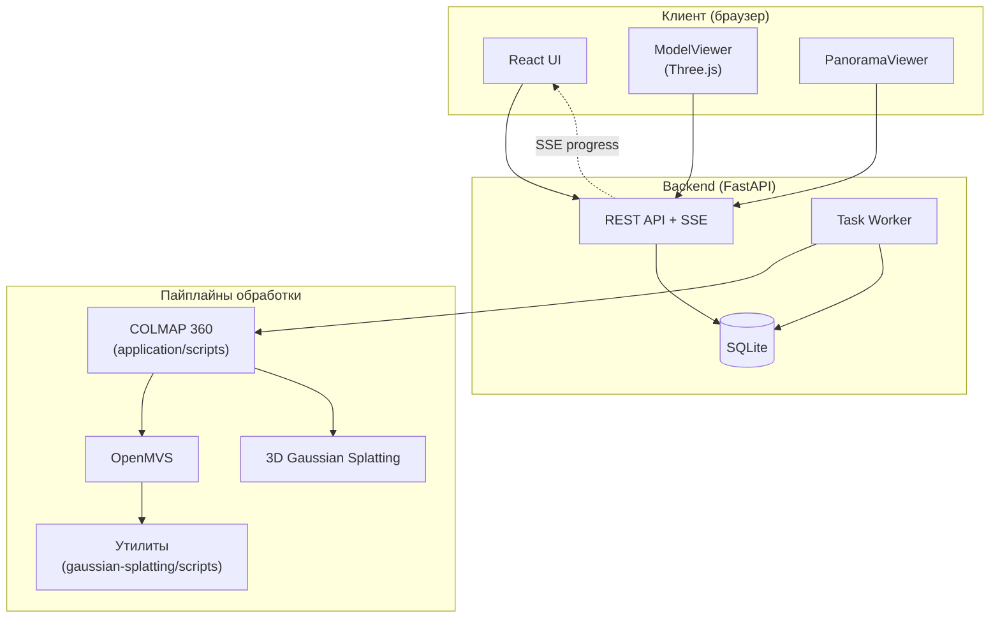

# 4D Digital Twin

**Платформа построения и веб-визуализации 4D-цифрового двойника** на основе 360°-видео (equirectangular / ERP).

> Система автоматически преобразует панорамное видео в трёхмерную модель пространства, связывает ERP-кадры с траекторией камеры в сцене и предоставляет интерактивный веб-интерфейс для просмотра mesh-моделей и Gaussian Splatting с панорамной навигацией.

---

## Содержание

- [О проекте](#о-проекте)
- [Принцип работы](#принцип-работы)
- [Архитектура](#архитектура)
- [Поддерживаемые пайплайны](#поддерживаемые-пайплайны)
- [Стек технологий](#стек-технологий)
- [Системные требования](#системные-требования)
- [Внешние зависимости](#внешние-зависимости)
- [Структура репозитория](#структура-репозитория)
- [Установка](#установка)
- [Конфигурация](#конфигурация)
- [Запуск](#запуск)
- [Пайплайны из командной строки](#пайплайны-из-командной-строки)
- [API](#api)
- [Разработка](#разработка)
- [Лицензия](#лицензия)

---

## О проекте

**4D Digital Twin** — программный комплекс для создания **4D-цифрового двойника** помещений и объектов инфраструктуры по данным 360°-съёмки.

| Измерение | Содержание |
|-----------|------------|
| **X, Y, Z** | Трёхмерная геометрия сцены (mesh GLB или point cloud PLY) |
| **T (время)** | Последовательность ERP-кадров, привязанных к позициям камеры в 3D |

Пользователь загружает видео через веб-интерфейс, выбирает алгоритм реконструкции и отслеживает прогресс в реальном времени. По завершении обработки доступны:

- интерактивный **3D-просмотр** (текстурированная mesh или Gaussian Splatting);
- **панорамная навигация** — клик по модели открывает ближайший ERP-кадр с той же точки обзора;
- скачивание результатов и логов обработки.

---

## Принцип работы

### Этап 1 — Подготовка данных

360°-видео (формат ERP) декодируется в последовательность панорамных кадров с заданной частотой (`fps`). Для пайплайнов на базе COLMAP 360 каждый ERP-кадр проецируется в несколько **перспективных (pinhole) видов** с известным полем зрения — это позволяет использовать классический COLMAP без модификации камеры SPHERE.

```
ERP-кадр (equirectangular)
        │
        ▼  ffmpeg v360 (e → flat)
┌───────────────────────────────┐
│  6 pinhole-видов на кадр:    │
│  5 горизонтальных + 1 вверх   │
└───────────────────────────────┘
```

Опционально применяется **маска нижней части** кадра (`mask-bottom`) для исключения каски оператора / штатива из SIFT-дескрипторов.

### Этап 2 — Structure from Motion (SfM)

COLMAP выполняет извлечение признаков, сопоставление и построение разреженной 3D-модели:

```
feature_extractor → matcher → mapper → [image_undistorter]
```

Результат: каталог `images/`, `sparse/<id>/`, `dense/` — стандартный COLMAP workspace.

### Этап 3 — Плотная реконструкция

В зависимости от выбранного пайплайна:

| Ветка | Алгоритм | Выход |
|-------|----------|-------|
| **Mesh** | OpenMVS: DensifyPointCloud → ReconstructMesh → RefineMesh → TextureMesh | GLB |
| **Splat** | 3D Gaussian Splatting (`train.py`) | PLY |

Для GLB дополнительно выполняется **postprocess** — исправление ориентации (Y-up), яркости материалов и downscale текстур для браузера.

### Этап 4 — Индексация панорам (4D-слой)

После SfM система строит `panorama_index.json`: для каждого ERP-кадра вычисляется **центр камеры в мировых координатах COLMAP**. При клике на 3D-модель фронтенд запрашивает ближайший ERP-кадр по евклидову расстоянию — пользователь «перемещается» по объекту во времени съёмки.

---

## Архитектура



### Компоненты

| Компонент | Роль |
|-----------|------|
| **FastAPI backend** | REST API, загрузка видео, управление задачами, раздача статики |
| **Task Worker** | Фоновая обработка очереди задач (один worker-поток) |
| **SQLite** | Хранение метаданных задач и статусов |
| **Server-Sent Events** | Real-time обновления прогресса без polling |
| **React frontend** | UI загрузки, списка задач, 3D- и панорамного просмотра |
| **Bash-скрипты** | Оркестрация COLMAP → MVS / 3DGS вне Python-процесса |
| **Python-утилиты** | Postprocess GLB, crop PLY, генерация масок |

---

## Поддерживаемые пайплайны

| ID | Название | Вход | Выход | Назначение |
|----|----------|------|-------|------------|
| `colmap360_openmvs` | COLMAP 360 + OpenMVS | 360° видео | GLB (mesh) | Текстурированная mesh-модель для браузера |
| `colmap360_3dgs` | COLMAP 360 + 3DGS | 360° видео | PLY (splats) | Neural radiance field, высокая детализация |
| `openmvg_openmvs` | OpenMVG + OpenMVS | видео / кадры | GLB / PLY | Классический SfM + dense MVS |
| `sphere_colmap_openmvs` | SphereSfM + OpenMVS | 360° ERP | GLB | SfM с нативной SPHERE-камерой |
| `gaussian_splatting` | Gaussian Splatting | COLMAP-сцена | PLY | 3DGS по готовой COLMAP-сцене |

> **Рекомендуемый пайплайн для 360°-съёмки:** `colmap360_openmvs` или `colmap360_3dgs`.

---

## Стек технологий

### Backend

| Технология | Версия | Назначение |
|------------|--------|------------|
| Python | 3.10+ | Runtime |
| FastAPI | ≥ 0.104 | HTTP API |
| Uvicorn | ≥ 0.24 | ASGI-сервер |
| SQLAlchemy | ≥ 2.0 | ORM, SQLite |
| Pydantic Settings | ≥ 2.0 | Конфигурация через `.env` |

### Frontend

| Технология | Версия | Назначение |
|------------|--------|------------|
| React | 19 | UI-компоненты |
| TypeScript | 5.5+ | Типизация |
| Vite | 5 | Сборка |
| Three.js | 0.184 | 3D-рендер mesh и splats |
| @mkkellogg/gaussian-splats-3d | 0.4 | Gaussian Splatting viewer |

### Алгоритмы реконструкции

| Инструмент | Тип | Лицензия |
|------------|-----|----------|
| [COLMAP](https://github.com/colmap/colmap) | SfM / MVS prep | BSD |
| [OpenMVS](https://github.com/cdcseacave/openMVS) | Dense mesh + texture | AGPL-3.0 |
| [OpenMVG](https://github.com/openMVG/openMVG) | SfM | MPL-2.0 |
| [SphereSfM](https://github.com/json87/SphereSfM) | COLMAP fork (SPHERE) | BSD |
| [3D Gaussian Splatting](https://github.com/graphdeco-inria/gaussian-splatting) | Neural rendering | Non-commercial research |

### Python-зависимости утилит (`gaussian-splatting/scripts/`)

| Пакет | Скрипты |
|-------|---------|
| `numpy` | postprocess_glb, crop, auto_crop |
| `Pillow` | postprocess_glb, gen_sphere_nadir_mask |
| `plyfile` | crop_gaussian_ply, auto_crop_gaussian_ply, make_demo_ply_subset |

---

## Системные требования

### Операционная система

| ОС | Поддержка | Примечание |
|----|-----------|------------|
| **Ubuntu 22.04 / 24.04 LTS** | Полная | Рекомендуется для production и GPU |
| Debian 12 | Полная | |
| Windows 10/11 | Частичная | UI и backend; пайплайны — через WSL2 |
| macOS | Частичная | UI; GPU CUDA для 3DGS недоступен на Apple Silicon |

### Минимальные требования

| Параметр | Минимум | Рекомендуется |
|----------|---------|---------------|
| CPU | 4 ядра | 8+ ядер |
| RAM | 8 GB | 32 GB |
| Диск | 50 GB SSD | 200+ GB NVMe |
| GPU | — | NVIDIA CUDA (8+ GB VRAM) |
| Python | 3.10 | 3.11 |
| Node.js | 20 LTS | 22 LTS |

### Требования по пайплайнам

| Пайплайн | GPU | RAM | Время (ориентир) |
|----------|-----|-----|------------------|
| COLMAP 360 (CPU) | — | 8 GB | 10–60 мин |
| COLMAP 360 (GPU SIFT) | OpenGL + xvfb | 8 GB | 5–30 мин |
| OpenMVS dense | CUDA желателен | 16–32 GB | 30–120 мин |
| 3D Gaussian Splatting | **CUDA обязателен** | 16+ GB | 1–4 ч |

> Объём диска и время сильно зависят от длительности видео, `fps` и разрешения ERP-кадров.

### Системные пакеты (Linux)

```bash
sudo apt update
sudo apt install -y \
    python3 python3-venv python3-pip \
    ffmpeg ffprobe \
    colmap \
    xvfb \
    git curl
```

---

## Внешние зависимости

> Сборки сторонних библиотек **не включены** в репозиторий. Их необходимо собрать или установить отдельно и указать пути в `.env`.

| Компонент | Репозиторий | Переменная `.env` |
|-----------|-------------|-------------------|
| COLMAP | https://github.com/colmap/colmap | `COLMAP_BIN` |
| OpenMVS | https://github.com/cdcseacave/openMVS | `OPENMVS_BIN` |
| OpenMVG | https://github.com/openMVG/openMVG | `OPENMVG_BIN` |
| SphereSfM | https://github.com/json87/SphereSfM | `SPHERESFM_BIN` |
| 3D Gaussian Splatting | https://github.com/graphdeco-inria/gaussian-splatting | `GAUSSIAN_ROOT` |
| ffmpeg | системный пакет | `FFMPEG_BIN` |

### Conda-окружение для 3DGS

```bash
git clone https://github.com/graphdeco-inria/gaussian-splatting.git /opt/gaussian-splatting
cd /opt/gaussian-splatting
conda env create -f environment.yml
conda activate gaussian_splatting
```

Путь к клону укажите в `GAUSSIAN_ROOT`. Скрипт `run_3dgs_from_colmap360.sh` автоматически ищет Python из env `gaussian_splatting`.

---

## Структура репозитория

```
.
├── README.md                          ← этот файл
├── application/
│   ├── backend/                       FastAPI, pipelines, worker, API
│   │   ├── main.py
│   │   ├── routes/                    tasks, files, panorama
│   │   ├── services/                  worker, cache, panorama_index
│   │   ├── pipelines/                 colmap360, mvs, sphere, gaussian
│   │   ├── config/settings.py         конфигурация (.env)
│   │   └── requirements.txt
│   ├── web/                           React + TypeScript (исходники)
│   │   ├── src/components/            ModelViewer, PanoramaViewer, …
│   │   └── package.json
│   ├── frontend/                      production-сборка UI (раздаётся backend)
│   ├── scripts/                       bash-пайплайны 360° → COLMAP → MVS/3DGS
│   ├── run.sh / run.bat               быстрый запуск
│   ├── QUICKSTART.md
│   └── DEVELOPMENT.md
└── gaussian-splatting/
    └── scripts/                       утилиты postprocess / crop / mask
        ├── postprocess_glb.py
        ├── crop_gaussian_ply.py
        ├── auto_crop_gaussian_ply.py
        └── gen_sphere_nadir_mask.py
```

### Исключено из репозитория

| Путь | Причина |
|------|---------|
| `application/backend/data/` | Загруженные видео и результаты реконструкции |
| `application/backend/venv/` | Виртуальное окружение Python |
| `application/web/node_modules/` | npm-зависимости |
| Сборки openMVG, openMVS, SphereSfM | Внешние репозитории |

---

## Установка

### 1. Клонирование

```bash
git clone https://github.com/<username>/4d-digital-twin.git
cd 4d-digital-twin
```

### 2. Backend

```bash
cd application/backend
python3 -m venv venv
source venv/bin/activate        # Windows: venv\Scripts\activate
pip install -r requirements.txt
```

### 3. Утилиты пайплайна

```bash
pip install numpy Pillow plyfile
```

### 4. Frontend (для разработки)

```bash
cd application/web
npm install
npm run build
cp -r dist ../frontend          # обновить production-сборку
```

### 5. Права на скрипты

```bash
chmod +x application/run.sh
chmod +x application/scripts/*.sh
```

---

## Конфигурация

Скопируйте шаблон и укажите пути к установленным инструментам:

```bash
cp application/backend/.env.example application/backend/.env
```

### Переменные окружения

| Переменная | Описание | Пример |
|------------|----------|--------|
| `BASE_DIR` | Корень backend | `./application/backend` |
| `DATABASE_URL` | SQLite | `sqlite:///./backend.db` |
| `FFMPEG_BIN` | ffmpeg | `/usr/bin/ffmpeg` |
| `COLMAP_BIN` | Каталог или бинарник COLMAP | `/usr/bin` |
| `OPENMVS_BIN` | Каталог OpenMVS binaries | `/opt/openMVS/bin` |
| `OPENMVG_BIN` | Каталог OpenMVG binaries | `/usr/local/bin` |
| `SPHERESFM_BIN` | SphereSfM build | `/opt/SphereSfM/build/src/exe` |
| `GAUSSIAN_ROOT` | Клон gaussian-splatting | `/opt/gaussian-splatting` |
| `SCRIPTS_DIR` | Bash-пайплайны | `./application/scripts` |
| `POSTPROCESS_GLB` | Postprocess GLB | `./gaussian-splatting/scripts/postprocess_glb.py` |
| `CAM_DB` | База камер OpenMVG | путь к `sensor_width_camera_database.txt` |
| `FFMPEG_FPS` | FPS извлечения кадров | `1` |
| `WORKER_THREADS` | Потоки COLMAP/OpenMVG | `8` |

---

## Запуск

### Веб-приложение (production)

**Linux / macOS:**

```bash
cd application
./run.sh
```

**Windows:**

```cmd
cd application
run.bat
```

Откройте в браузере: **http://localhost:8000**

| URL | Описание |
|-----|----------|
| http://localhost:8000 | Веб-интерфейс |
| http://localhost:8000/docs | Swagger UI (OpenAPI) |
| http://localhost:8000/redoc | ReDoc |
| http://localhost:8000/health | Health check |

### Frontend (режим разработки)

```bash
# Терминал 1 — backend
cd application/backend
source venv/bin/activate
uvicorn main:app --host 0.0.0.0 --port 8000 --reload

# Терминал 2 — frontend dev server
cd application/web
npm run dev
# → http://localhost:5173
```

### Рабочий процесс в UI

1. Загрузите **360°-видео** (MP4, до 5 GB).
2. Выберите **алгоритм реконструкции**.
3. Дождитесь завершения — прогресс обновляется в реальном времени.
4. Откройте задачу → просмотр **3D-модели** и **панорамы** по клику.

---

## Пайплайны из командной строки

Скрипты в `application/scripts/` можно запускать независимо от веб-UI.

### COLMAP 360 → OpenMVS → GLB

```bash
./application/scripts/run_colmap360_mvs.sh \
    --input  /path/to/pano.mp4 \
    --output /path/to/scene_out \
    --fps 2 \
    --mask-bottom 0.10
```

### COLMAP 360 → 3D Gaussian Splatting

```bash
conda activate gaussian_splatting

./application/scripts/run_colmap360_3dgs.sh \
    --input  /path/to/pano.mp4 \
    --output /path/to/scene_out \
    --fps 2 \
    -- --iterations 30000
```

### Только COLMAP (без dense)

```bash
./application/scripts/run_colmap_360.sh \
    --input  /path/to/pano.mp4 \
    --output /path/to/colmap_ws \
    --fps 2
```

### Превью маски каски

```bash
./application/scripts/preview_mask_360.sh \
    --input /path/to/pano.mp4 \
    --time 12.5 \
    --output-dir /tmp/mask_preview \
    --mask-bottom 0.10
```

### Postprocess GLB для браузера

```bash
python gaussian-splatting/scripts/postprocess_glb.py \
    input_texture.glb output_web.glb \
    --rotation auto \
    --max-texture 4096 \
    --jpeg
```

### Crop PLY (3DGS)

```bash
# Автоматический crop для indoor-сцен
python gaussian-splatting/scripts/auto_crop_gaussian_ply.py \
    in.ply out_cropped.ply \
    --mode cameras --interior \
    --scene /path/to/colmap_scene

# Ручной crop по bounding box
python gaussian-splatting/scripts/crop_gaussian_ply.py \
    in.ply out.ply --max-y 2.8 --list-bounds
```

---

## API

Базовый URL: `/api/v1`

### Задачи

| Метод | Endpoint | Описание |
|-------|----------|----------|
| `POST` | `/tasks` | Создать задачу (multipart: video + pipeline) |
| `GET` | `/tasks` | Список задач |
| `GET` | `/tasks/{id}` | Детали задачи |
| `GET` | `/tasks/{id}/stream` | SSE-поток обновлений |
| `GET` | `/tasks/{id}/manifest` | Манифест панорам (4D-индекс) |
| `GET` | `/tasks/{id}/panorama/nearest?x=&y=&z=` | Ближайший ERP-кадр |
| `GET` | `/tasks/{id}/result` | Скачать результат |
| `GET` | `/tasks/{id}/log` | Скачать лог |
| `POST` | `/tasks/{id}/restart` | Перезапустить задачу |

### Файлы

| Метод | Endpoint | Описание |
|-------|----------|----------|
| `GET` | `/files/{task_id}/{filename}` | Статический файл результата |

---

## Разработка

Подробнее:

- [application/DEVELOPMENT.md](application/DEVELOPMENT.md) — структура кода, добавление компонентов и endpoints
- [application/QUICKSTART.md](application/QUICKSTART.md) — быстрый старт и troubleshooting

### Сборка frontend

```bash
cd application/web
npm run build
cp -r dist ../frontend
```

### Smoke-тест API

```bash
# Требует запущенный backend и demo-задачу
./application/scripts/e2e_smoke_test.sh
```

---

## Лицензия

Код данного репозитория распространяется под лицензией **MIT** (см. [LICENSE](LICENSE)).

Сторонние компоненты (COLMAP, OpenMVS, OpenMVG, SphereSfM, 3D Gaussian Splatting) подчиняются **собственным лицензиям** upstream-репозиториев. Перед коммерческим использованием 3DGS проверьте [лицензию Inria](https://github.com/graphdeco-inria/gaussian-splatting).

---

<p align="center">
  <strong>4D Digital Twin</strong> · 4D-цифровой двойник на основе 360°-видео<br>
  Дипломная работа
</p>
